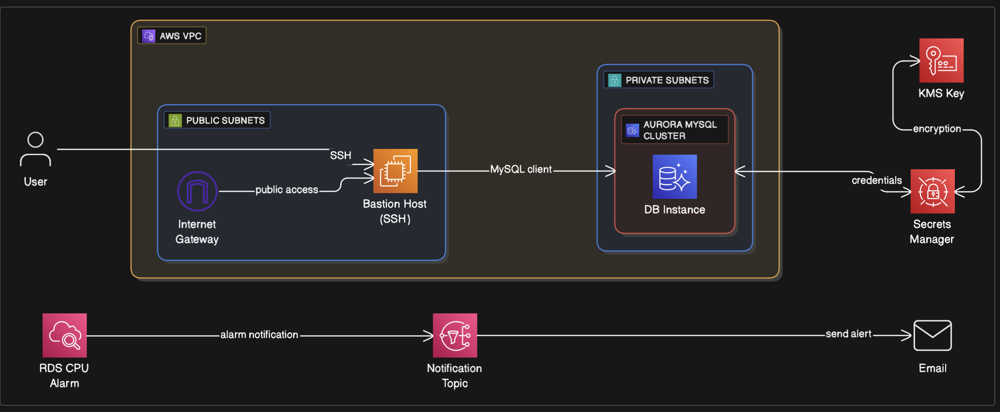
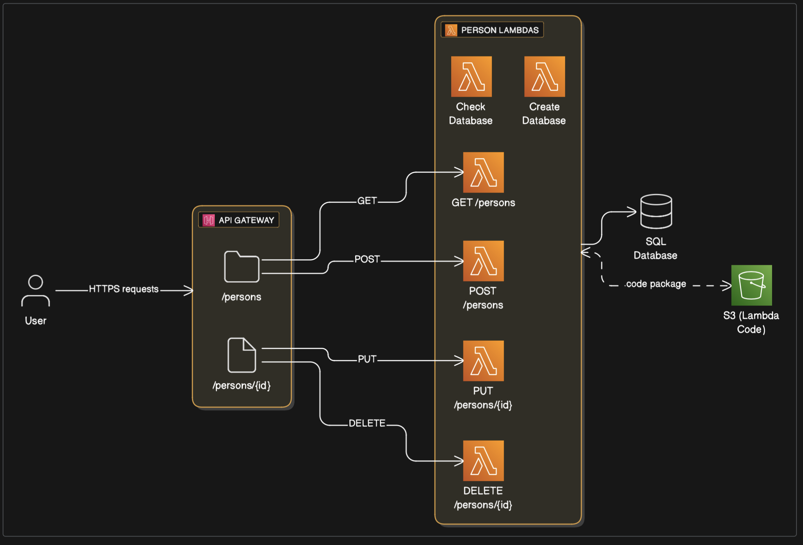
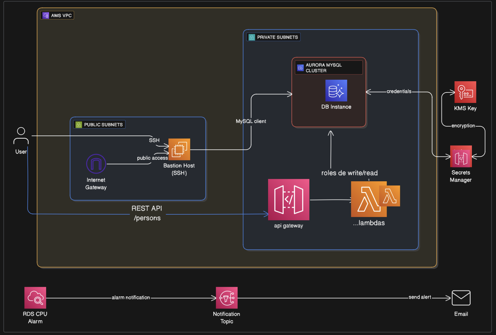

# python-demo-11-10-2025
Demo para Rest Api con lambda , api gateway, rds mysql en aws.  

```bash
    npm i
```

Se necesita un usurio de aws, se recomienda ingresar a AWS Console y IAM  crear un nuevo usuario

A la hora de crearlo se necesita agregarlo a un grupo, este grupo puede ser creado previamente o en el instante , selecione rol de "	
AdministratorAccess". Luego de todo crear usuario y en el apartado de 'credenciales de seguridad' se deben generar nuevas claves de acceso, en el panel hay un apartado donde se muestran las actuales. Al crear las llaves se necesita seleccionar en la etapa de 'caso de uso' la opcion de 'CLI' la cual nos permitira realizar comandos con AWS CLI. Luego de haberlas generados necesitamos los valores de 'clave de acceso' y 'clave de accesso secreta' , estos valores se deben copiar para luego introducirlos en los secrets que se usaran en github actions. Para setear secrets para las actions se necesitar ir a 'Settings', en el sidebar seleccion el item 'Secrets and Variables" y luego "Actions"  y ahi se podran agregar las secrets.

Luego de crear el usuario y agregarlo a un grupo se necesita crear un politica que brinde permisos para el deploy del proyecto

→ Politicas => Crear politica:

Cambiar al modo json y pegar lo siguiente

{
  "Version": "2012-10-17",
  "Statement": [
    { "Effect": "Allow", "Action": [
      "ec2:*",
      "rds:*",
      "s3:*",
      "cloudformation:*",
      "lambda:*",
      "iam:PassRole",
      "iam:GetRole",
      "iam:CreateRole",
      "iam:AttachRolePolicy",
      "secretsmanager:*",
      "sns:*",
      "apigateway:*",
      "cloudwatch:*"
    ], "Resource": "*" }
  ]
}


Luego darle nombre a la policita  [ nombre politica ]

volver al menu de usuarios =>  [usuario creado ] => agregar politicas  => Adjuntar politicas directamente => Buscar [nobmre politica ] => agregar permisos


Se necesita establecer los siguientes secrets en github

- AWS_ACCESS_KEY_ID
- AWS_SECRET_ACCESS_KEY // 
- AWS_REGION // region
- LAMBDA_ARTIFACT_BUCKET // s3 


Para desarrollar es mejor hacer un checkout a una rama que no sea "main" o "develop" y cuando se quiera desplegar en modo de test hacer push a develop, esto generara unos workflows que brindaran un deploy y unas pruebas que de ser pasadas se realizara un pull request y automerge hacia main, luego de eso se realizara un nuevo deploy con los cambios ya en main. Tambien esta configurado en las github actions para que se deploy cuando se haga push a main


El archivo Iac/cloudFormationStack.yaml representa este grafico


El archivo Iac/api.yaml representa esta grafico



Luego de crearse ambos el resultado es el siguiente:


el archivo prepare-lambdas-local.sh permite que las lambdas se empaqueten y puedan ser subidas manualmente o desde AWS CLI


Para la creacion de la db se utilizo la lambda 'DataBaseCreation' que se encuentra en la carpeta lambdas, tambien se creo otra lambda llamada 'CheckDataBase' para verificar la correcta creacion.